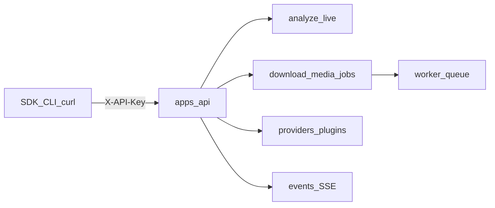

# MediaCore REST API

Base URL: `http://localhost:8000`  
Auth header: `X-API-Key: <key>` (dev default: `dev-api-key-change-me`)

Interactive OpenAPI: [http://localhost:8000/docs](http://localhost:8000/docs)  
Compatibility alias: `/api/v1/*` mirrors `/v1/*`.

Public (no key): `GET /health`, `GET /metrics`.



## Endpoint map

### Core media

| Method | Path | Notes |
|--------|------|-------|
| POST | `/v1/analyze` | Sync metadata + formats + manifest |
| POST | `/v1/live` | Live stream probe |
| POST | `/v1/download` | Async download job (`202`) |
| POST | `/v1/audio` | Extract audio (FFmpeg plugin) |
| POST | `/v1/video` | Video download job |
| POST | `/v1/subtitles` | Subtitle extraction job |
| POST | `/v1/thumbnail` | Thumbnail job |
| POST | `/v1/convert` | Format conversion (`options.container`) |
| POST | `/v1/clip` | Clip (`options.start` / `options.duration`) |
| POST | `/v1/jobs` | Create job (download alias) |

### Jobs & events

| Method | Path | Notes |
|--------|------|-------|
| GET | `/v1/jobs` | List jobs for the API key (`?limit=`) |
| GET | `/v1/jobs/{id}` | Job status |
| POST | `/v1/jobs/{id}/cancel` | Cancel queued/running job (`409` if terminal) |
| GET | `/v1/events` | Recent in-process events (`?limit=` `&job_id=`) |
| GET | `/v1/events/stream` | SSE stream (replay + live; `?job_id=` `&replay_only=`) |

### Catalog & plugins

| Method | Path | Notes |
|--------|------|-------|
| GET | `/v1/providers` | Working + all catalog stub providers (+ capabilities) |
| GET | `/v1/providers/catalog` | Catalog summary counts |
| GET | `/v1/providers/catalog/search?q=` | Search extractors (`&limit=`) |
| GET | `/v1/plugins` | Discovered plugins (kind, status, capabilities) |
| GET | `/v1/system` | Version, provider/plugin counts, FFmpeg ready |

See also: [Platforms UI](/platforms/) · [Plugins UI](/plugins/) · [Providers vs plugins](/plugins/providers).

### Ops

| Method | Path | Notes |
|--------|------|-------|
| GET | `/health` | Liveness |
| GET | `/metrics` | Prometheus text |

---

## Auth

```bash
curl -s -H "X-API-Key: dev-api-key-change-me" http://localhost:8000/v1/system
```

Missing/invalid key → `401`. Domain errors (`MediaCoreError`) → `400` with `{ "error", "code" }`.

---

## Analyze

```bash
curl -s -H "X-API-Key: dev-api-key-change-me" \
  -H "Content-Type: application/json" \
  -d '{"url":"https://example.com/video.mp4"}' \
  http://localhost:8000/v1/analyze
```

**Request:** `{ "url": string }`  
**Response:** `platform`, `title`, `duration`, `thumbnail`, `formats[]`, `manifest`, `is_live`, `subtitles[]`, …

Platform modules match hosts: direct media URLs download; page/watch URLs return `provider_not_configured` until a permitted provider is wired.

---

## Jobs

Download and media ops return `202`:

```json
{ "job_id": "…", "status": "queued", "type": "download" }
```

Poll `GET /v1/jobs/{id}` for `status`, `result_url`, `error`.

Media ops body:

```json
{
  "url": "https://example.com/video.mp4",
  "path": null,
  "format": "original",
  "options": { "container": "mp4", "start": 0, "duration": 10 }
}
```

Provide `url` **or** `path`. Audio / thumbnail / convert / clip require the **ffmpeg** plugin + binary (`GET /v1/system` → `ffmpeg: true`).

Cancel:

```bash
curl -s -X POST -H "X-API-Key: dev-api-key-change-me" \
  http://localhost:8000/v1/jobs/{id}/cancel
```

---

## Events

List recent events:

```bash
curl -s -H "X-API-Key: dev-api-key-change-me" \
  "http://localhost:8000/v1/events?limit=20&job_id="
```

SSE stream (replays history, then live):

```bash
curl -N -H "X-API-Key: dev-api-key-change-me" \
  "http://localhost:8000/v1/events/stream?job_id="
```

Event types include `JobCreated`, `AnalyzeStarted`, `MetadataReady`, `DownloadStarted`, `Progress`, `ProcessingStarted`, `Completed`, `Failed`, `Cancelled`. Notification/webhook plugins may receive the same events via `on_event`.

---

## Providers

```bash
# All registered providers (~1360+ modules + builtins)
curl -s -H "X-API-Key: dev-api-key-change-me" \
  http://localhost:8000/v1/providers | head

# Summary
curl -s -H "X-API-Key: dev-api-key-change-me" \
  http://localhost:8000/v1/providers/catalog

# Search extractors
curl -s -H "X-API-Key: dev-api-key-change-me" \
  "http://localhost:8000/v1/providers/catalog/search?q=youtube&limit=20"
```

**Provider item:**

```json
{
  "name": "vimeo",
  "status": "active",
  "source": null,
  "capabilities": ["metadata", "manifest", "formats", "download"]
}
```

**Catalog summary:** `extractors`, `base_platforms`, `providers_indexed`, `providers_with_hosts`, `broken`, `note`.

Statuses: `active` / working builtins · `not_configured` / stub · `broken` · `metadata_only`.

---

## Plugins

```bash
curl -s -H "X-API-Key: dev-api-key-change-me" \
  http://localhost:8000/v1/plugins
```

**Plugin item:**

```json
{
  "name": "mediacore-plugin-storage-local",
  "version": "0.1.0",
  "kind": "storage",
  "description": "Local filesystem storage for MediaCore jobs",
  "status": "available",
  "capabilities": ["store", "delete", "public_url"],
  "path": "…/plugins/storage-local"
}
```

Kinds: `metadata` · `provider` · `storage` · `authentication` · `ai` · `ffmpeg` · `translation` · `notifications` · `analytics` · `webhooks`.

CLI mirror (grouped by kind):

```bash
uv run mediacore plugin list
```

Docs UI catalog: [Plugins](/plugins/) (`docs/public/plugins.json` via `scripts/generate_plugins_docs.py`).

---

## System

```bash
curl -s -H "X-API-Key: dev-api-key-change-me" \
  http://localhost:8000/v1/system
```

```json
{
  "name": "MediaCore",
  "version": "…",
  "environment": "development",
  "providers": 1377,
  "plugins": 19,
  "ffmpeg": true,
  "events_retained": 12
}
```

---

## Errors

| HTTP | When |
|------|------|
| 400 | Validation / `MediaCoreError` (`code` e.g. `unsupported_url`, `provider_not_configured`, `plugin_error`) |
| 401 | Missing or invalid API key |
| 404 | Unknown job |
| 409 | Cancel on a terminal job |

```json
{ "error": "…", "code": "provider_not_configured" }
```

---

## SDKs

Thin clients wrap the same `/v1` surface — see [SDK overview](/sdk/) and per-language guides (JavaScript, Python, Go, Rust, …).
