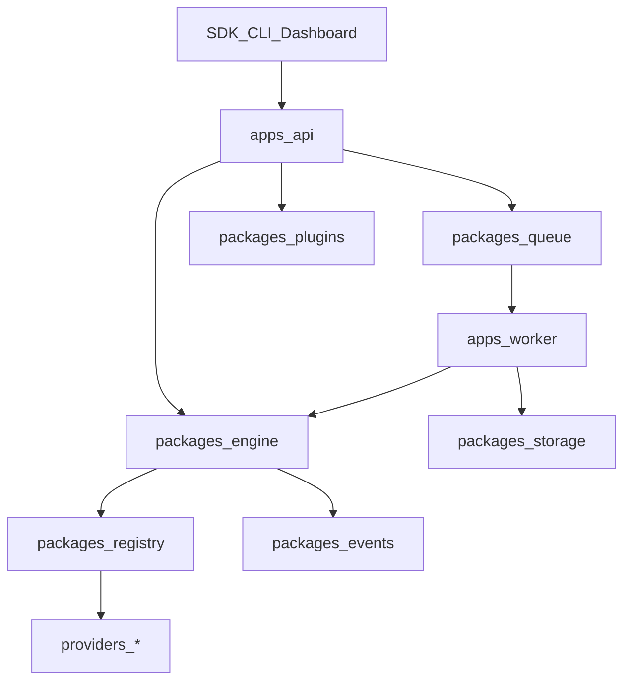

# MediaCore Architecture

## Vision

MediaCore is a **media infrastructure platform**: extraction, processing, automation, SDKs, and plugins — not a single-purpose downloader.

## Layout

```text
apps/        api, gateway, dashboard, desktop, studio, worker, cli
packages/    core, engine, registry, plugins, events, queue, storage, media, …
providers/   generic, filesystem, vimeo, example  (independent of core)
plugins/     storage-*, ffmpeg, whisper, webhook, telegram, …
sdk/         javascript, typescript, python, rust, go, dart, csharp
crates/      mediacore-engine (Rust foundation — roadmap)
```

## Core principles

1. **Core does not depend on providers** — only the provider interface.
2. **Everything else is a plugin** when possible (storage, ffmpeg, AI, notifications).
3. **Same pipeline everywhere** — API, CLI, Desktop, Studio emit the same events.
4. **Deployment modes** — CLI, desktop, docker, k8s, embedded, local-only.

## Request flow



## Events

`JobCreated` → `AnalyzeStarted` → `MetadataReady` → `DownloadStarted` → `Progress` → `ProcessingStarted` → `Completed` | `Failed` | `Cancelled`
