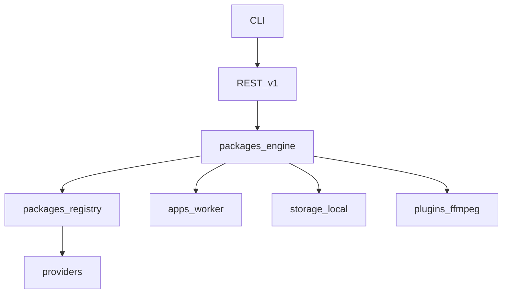

<script setup>
const links = [
  { title: "Repository layout", href: "/architecture/layout", hint: "Canonical paths", icon: "https://cdn.simpleicons.org/files/0ea5e9" },
  { title: "Overview", href: "/architecture/overview", hint: "Engine, events, flow", icon: "https://cdn.simpleicons.org/python/3776AB" },
  { title: "vs yt-dlp layout", href: "/architecture/mediacore-vs-ytdlp", hint: "Where folders map", icon: "https://cdn.simpleicons.org/git/F05032" },
  { title: "Vision", href: "/getting-started/vision", hint: "Product positioning", icon: "https://cdn.simpleicons.org/rocket/FF4438" },
  { title: "Plugins", href: "/plugins/", hint: "ffmpeg + storage-local", icon: "https://cdn.simpleicons.org/npm/CB3837" },
  { title: "Deployment", href: "/deployment/", hint: "Local + Docker", icon: "https://cdn.simpleicons.org/docker/2496ED" },
]
const principles = [
  { value: "CLI+API", label: "Download surface" },
  { value: "Providers", label: "Site knowledge" },
  { value: "Engine", label: "Provider-agnostic" },
  { value: "ffmpeg", label: "Post-download" },
]
</script>

<DocHero
  eyebrow="System design"
  title="Architecture"
  lead="Permitted media download CLI/API — analyze, download, convert. Not a scraper clone."
/>

<DocStats :items="principles" />

## Layers



## Ecosystem

```text
API · CLI · Worker · Engine · Registry · Providers · ffmpeg · storage-local · Docs · TestKit
```

## Deep dive

<DocLinks :items="links" />
