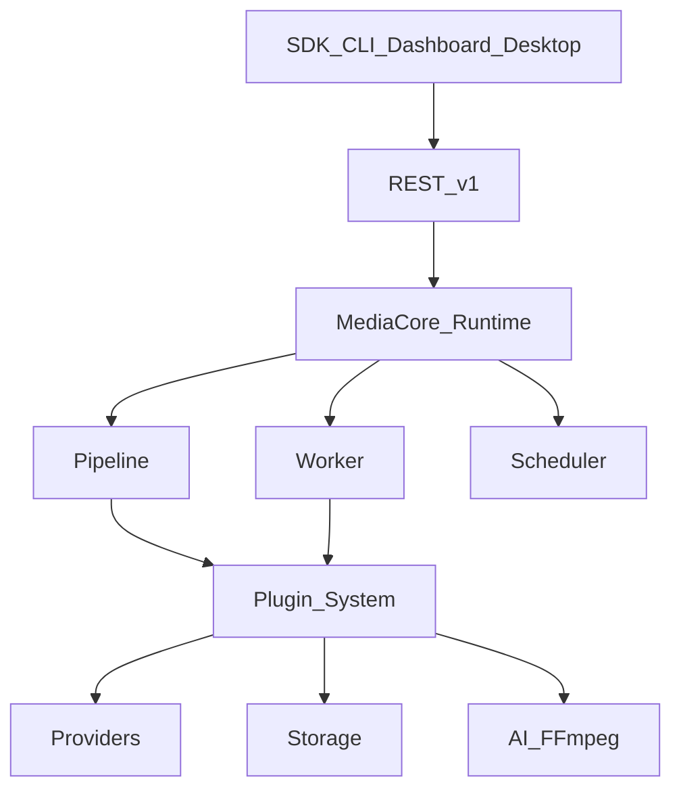

<script setup>
const links = [
  { title: "Overview", href: "/architecture/overview", hint: "Engine, events, flow", icon: "https://cdn.simpleicons.org/python/3776AB" },
  { title: "Relationships", href: "/architecture/relationships", hint: "Interactive dependency graph", icon: "https://cdn.simpleicons.org/graphql/E10098" },
  { title: "Vision", href: "/getting-started/vision", hint: "Product positioning", icon: "https://cdn.simpleicons.org/rocket/FF4438" },
  { title: "Plugins", href: "/plugins/", hint: "Extension model", icon: "https://cdn.simpleicons.org/npm/CB3837" },
  { title: "Deployment", href: "/deployment/", hint: "Run modes", icon: "https://cdn.simpleicons.org/docker/2496ED" },
]
const principles = [
  { value: "Core", label: "Provider-agnostic" },
  { value: "Plugins", label: "Everything else" },
  { value: "One pipeline", label: "API · CLI · Apps" },
  { value: "SDK parity", label: "Same surface" },
]
</script>

<DocHero
  eyebrow="System design"
  title="Architecture"
  lead="Open media infrastructure — Extract • Process • Automate • Deliver. Not a single-purpose downloader."
/>

<DocStats :items="principles" />

## Layers

<ArchitectureLayers />



## Ecosystem

```text
Engine · Runtime · API · SDK · CLI · Dashboard · Desktop · Studio
Plugin Registry · Marketplace · Docs · Benchmark · TestKit
```

## Deep dive

<DocLinks :items="links" />
