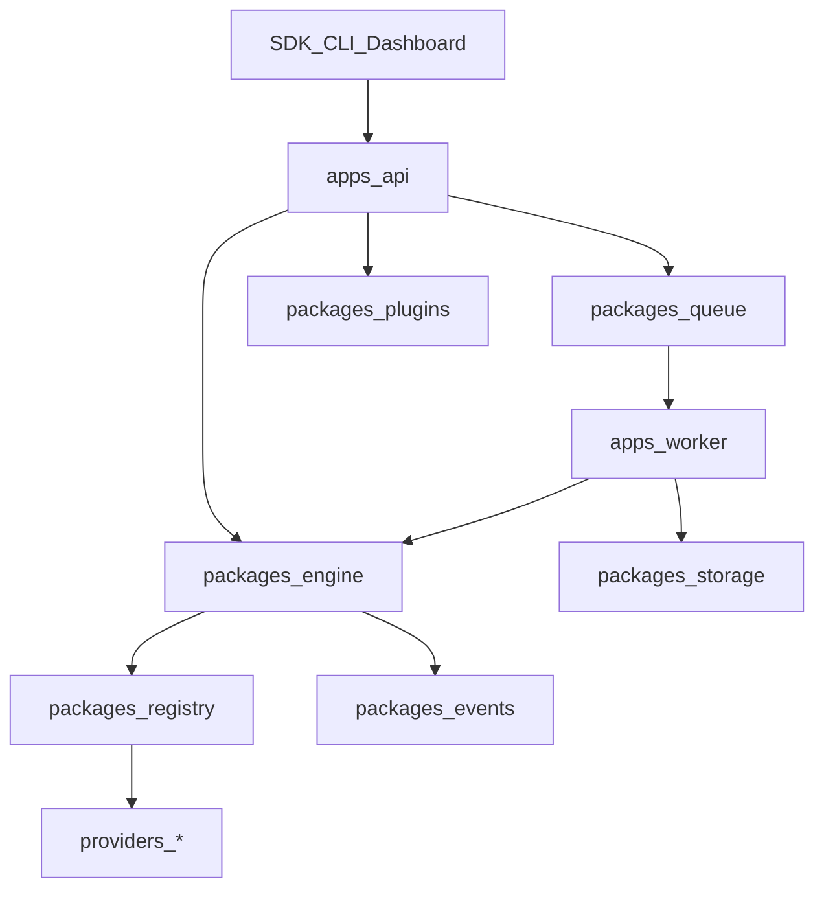

# MediaCore Architecture

## Vision

**The Open Media Infrastructure Platform** — Extract • Process • Automate • Deliver.

Full product vision: [Vision](/getting-started/vision). MediaCore is not a video downloader; it is reusable media infrastructure (engine, runtime, plugins, SDKs, Studio).

```text
MediaCore → Plugin System → Providers → Media Pipeline → SDK → Application
```

## Layout

```text
apps/        api, gateway, dashboard, desktop, studio, worker, cli
packages/    core, engine, registry, plugins, events, queue, storage, media, …
providers/   generic, filesystem, vimeo, example  (independent of core)
plugins/     storage-*, ffmpeg, whisper, webhook, telegram, …
sdk/         javascript, typescript, python, rust, go, dart, csharp, …
crates/      mediacore-engine (Rust foundation — roadmap)
```

## Engine vs runtime

| Layer | Responsibility |
|-------|----------------|
| **Engine** | Generic: URL, HTTP, cache, queue, pipeline, jobs, events, config, storage interface, plugins, scheduler, logging, metrics, security, telemetry |
| **Runtime** | Execute jobs: Queue → Worker → Pipeline → Events (local, Docker, K8s, server, desktop, embedded) |

No platform-specific code in the engine.

## Core principles

1. **Core first** — small, stable, provider-agnostic; no YouTube/TikTok/etc. knowledge in core.
2. **Plugins for everything else** — providers, storage, AI, auth, notifications, integrations.
3. **Same pipeline everywhere** — API, CLI, Desktop, Studio share jobs and events.
4. **SDK consistency** — same concepts and method names across languages.
5. **Deployment modes** — CLI, desktop, docker, k8s, embedded, local-only.

## Request flow



## Events

Canonical lifecycle (source of truth: `packages/events/bus.py` — `EventType`):

`JobCreated` → `AnalyzeStarted` → `MetadataReady` → `DownloadStarted` → `Progress` → `ProcessingStarted` → `Completed` | `Failed` | `Cancelled`

### Envelope

```json
{
  "type": "Progress",
  "payload": { "job_id": "…", "percent": 42, "bytes_done": 1000, "bytes_total": 2400 },
  "at": "2026-07-23T12:00:00+00:00"
}
```

### Fan-out

- In-process `EventBus` for emit/listen in each process.
- Redis pub/sub channel `mediacore:events` bridges API ↔ worker (`EVENTS_REDIS_ENABLED`, `REDIS_URL`).
- Remote ingest uses `emit_remote` so events are not re-published (no echo loop).

### Consumer API

| Endpoint | Use |
|----------|-----|
| `GET /v1/events?limit=&job_id=` | History (API key) |
| `GET /v1/events/stream?job_id=&replay_only=` | SSE live stream (`replay_only` exits after history) |
| `POST /v1/jobs/{id}/cancel` | Sets cancelled + emits `Cancelled` |

Compatibility alias: `/api/v1/*`.

### Consumers

| Consumer | How |
|----------|-----|
| Dashboard | `/events` page polls `/v1/events` |
| CLI | `mediacore events [--follow] [--job-id]` |
| Webhooks | `mediacore-plugin-webhook` when `MEDIACORE_WEBHOOK_URL` / `WEBHOOK_URL` set |
| Desktop | Polls `/v1/events` (scaffold) |
| Bots | Telegram / Discord listeners when tokens/webhook URLs set |
