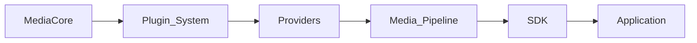
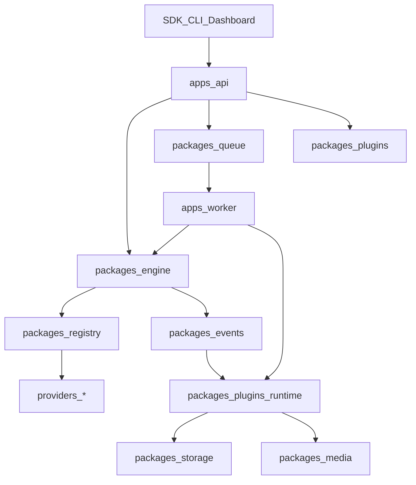

<script setup>
const links = [
  { title: "Plugins", href: "/plugins/", hint: "Capabilities", icon: "https://cdn.simpleicons.org/npm/CB3837" },
  { title: "Platforms", href: "/platforms/", hint: "Providers", icon: "https://cdn.simpleicons.org/youtube/FF0000" },
  { title: "API events", href: "/api/", hint: "SSE & history", icon: "https://cdn.simpleicons.org/fastapi/009688" },
  { title: "Deploy", href: "/deployment/", hint: "Local → K8s", icon: "https://cdn.simpleicons.org/kubernetes/326CE5" },
]
</script>

<DocHero
  eyebrow="Deep dive"
  title="Architecture overview"
  lead="Layout, engine vs runtime, request flow, and the event bus that ties jobs together."
/>

## Vision

**The Open Media Infrastructure Platform** — Extract • Process • Automate • Deliver.



Full product story: [Vision](/getting-started/vision).

## Layout

```text
apps/        api, gateway, dashboard, desktop, studio, worker, cli
packages/    core, engine, registry, plugins, events, queue, storage, media, …
providers/   generic, filesystem, vimeo, example  (independent of core)
plugins/     storage-*, ffmpeg, whisper, webhook, telegram, …
sdk/         javascript, typescript, python, rust, go, dart, csharp, …
crates/      mediacore-engine (Rust foundation — roadmap)
```

## Engine vs runtime

| Layer | Responsibility |
|-------|----------------|
| **Engine** | Generic: URL, HTTP, cache, queue, pipeline, jobs, events, config, storage interface, plugins, scheduler, logging, metrics, security, telemetry |
| **Runtime** | Execute jobs: Queue → Worker → Pipeline → Events (local, Docker, K8s, server, desktop, embedded) |

No platform-specific code in the engine.

## Core principles

1. **Core first** — small, stable, provider-agnostic.
2. **Plugins for everything else** — storage, AI, auth, notifications, integrations.
3. **Same pipeline everywhere** — API, CLI, Desktop, Studio share jobs and events.
4. **SDK consistency** — same concepts across languages.
5. **Deployment modes** — CLI, desktop, docker, k8s, embedded, local-only.

## Request flow



## Events

`JobCreated` → `AnalyzeStarted` → `MetadataReady` → `DownloadStarted` → `Progress` → `ProcessingStarted` → `Completed` | `Failed` | `Cancelled`

### Envelope

```json
{
  "type": "Progress",
  "payload": { "job_id": "…", "percent": 42 },
  "at": "2026-07-23T12:00:00+00:00"
}
```

### Fan-out

- In-process `EventBus`
- Redis channel `mediacore:events` when `EVENTS_REDIS_ENABLED`
- `GET /v1/events` · `GET /v1/events/stream` · webhook / bot plugins

## Continue

<DocLinks :items="links" />
