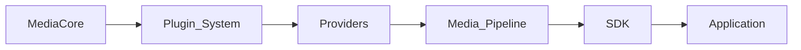
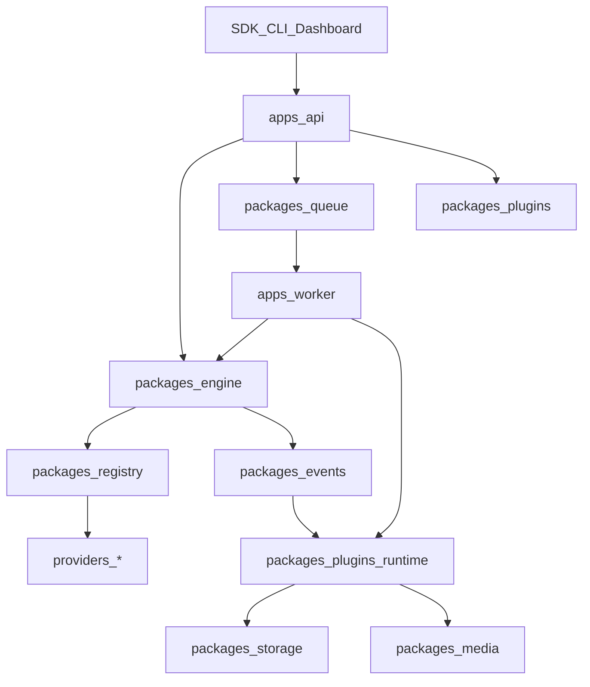

<script setup>
const links = [
  { title: "Plugins", href: "/plugins/", hint: "Capabilities", icon: "https://cdn.simpleicons.org/npm/CB3837" },
  { title: "Platforms", href: "/platforms/", hint: "Providers", icon: "https://cdn.simpleicons.org/youtube/FF0000" },
  { title: "API events", href: "/api/", hint: "SSE & history", icon: "https://cdn.simpleicons.org/fastapi/009688" },
  { title: "Deploy", href: "/deployment/", hint: "Local → K8s", icon: "https://cdn.simpleicons.org/kubernetes/326CE5" },
]
</script>

<DocHero
  eyebrow="Deep dive"
  title="Architecture overview"
  lead="Layout, engine vs runtime, request flow, and the event bus that ties jobs together."
/>

## Vision

**The Open Media Infrastructure Platform** — Extract • Process • Automate • Deliver.



Full product story: [Vision](/getting-started/vision).

## Layout

Full path table: [Repository layout](./layout).

```text
apps/        api · worker · cli
packages/    core · engine · registry · queue · storage · events · plugins · …
providers/   <name>/ working  ·  modules/ catalog  ·  platforms/ hosts
plugins/     ffmpeg · storage-local
docs/ · tests/ · scripts/ · docker/ · mediacore/
```

Removed product shells: dashboard, desktop, studio, gateway, scheduler, sdk, benchmarks, crates, helm.

Contributor map: [MediaCore vs yt-dlp](./mediacore-vs-ytdlp) · [`providers/README.md`](../../providers/README.md).

## Engine vs runtime

| Layer | Responsibility |
|-------|----------------|
| **Engine** | Generic: URL, HTTP, cache, queue, pipeline, jobs, events, config, storage, plugins |
| **Runtime** | Execute jobs: Queue → Worker → Pipeline → Events (local or Docker) |

No platform-specific code in the engine.

## Core principles

1. **Core first** — small, stable, provider-agnostic.
2. **Plugins only where needed** — `ffmpeg` + `storage-local` in the slim tree.
3. **Same pipeline** — API and CLI share analyze/download jobs.
4. **SDK consistency** — same concepts across languages.
5. **Deployment modes** — CLI, desktop, docker, k8s, embedded, local-only.

## Request flow



## Events

`JobCreated` → `AnalyzeStarted` → `MetadataReady` → `DownloadStarted` → `Progress` → `ProcessingStarted` → `Completed` | `Failed` | `Cancelled`

### Envelope

```json
{
  "type": "Progress",
  "payload": { "job_id": "…", "percent": 42 },
  "at": "2026-07-23T12:00:00+00:00"
}
```

### Fan-out

- In-process `EventBus`
- Redis channel `mediacore:events` when `EVENTS_REDIS_ENABLED`
- `GET /v1/events` · `GET /v1/events/stream` · webhook / bot plugins

## Continue

<DocLinks :items="links" />
