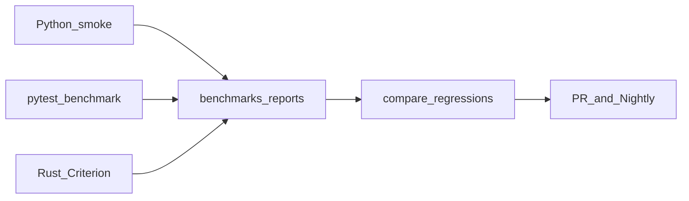

<script setup>
const targets = [
  { value: "< 1 ms", label: "URL parse" },
  { value: "< 10 ms", label: "Metadata" },
  { value: "> 200k/s", label: "Queue ops" },
  { value: "> 1M/s", label: "Events" },
]
const links = [
  { title: "Testing", href: "/getting-started/testing", hint: "TestKit & markers", icon: "https://cdn.simpleicons.org/pytest/0A9EDC" },
  { title: "Roadmap", href: "/getting-started/roadmap", hint: "v1.0 quality", icon: "https://cdn.simpleicons.org/git/F05032" },
  { title: "GitHub suite", href: "https://github.com/vannyakh/mediacore/blob/main/benchmarks/README.md", hint: "Full layout", icon: "https://cdn.simpleicons.org/github/ffffff" },
]
</script>

<DocHero
  eyebrow="Performance"
  title="Benchmarks"
  lead="Standalone suite for latency, memory, scalability, and regressions — Python smoke, pytest-benchmark, and Rust Criterion."
/>

## v1.0 targets

<DocStats :items="targets" />



## Run

```bash
# Python smoke (current runtime)
uv run python -m packages.mediacore_benchmark.runner

# pytest-benchmark
uv run pytest -m benchmark --benchmark-only

# Rust Criterion
cargo bench -p mediacore-benchmarks
```

## Toolkit

`packages/mediacore_benchmark`:

- Smoke suites → dated reports under `benchmarks/reports/`
- Compare runs / regressions (`benchmarks/scripts/compare.py`)
- Export JSON + Markdown summaries

## CI gates

| Gate | Suite |
|------|--------|
| PR | Optional Python smoke |
| Nightly | pytest-benchmark + smoke (+ Criterion when available) |

## Related

<DocLinks :items="links" />
