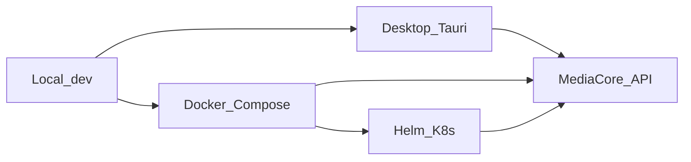

<script setup>
const modes = [
  { title: "Local API", href: "#local-dev", hint: "Fastest loop", icon: "https://cdn.simpleicons.org/python/3776AB" },
  { title: "Docker", href: "#docker-compose", hint: "Team / CI-like", icon: "https://cdn.simpleicons.org/docker/2496ED" },
  { title: "Helm", href: "#helm--kubernetes", hint: "Kubernetes", icon: "https://cdn.simpleicons.org/helm/0F1689" },
  { title: "Desktop", href: "#runtime-modes", hint: "Tauri client", icon: "https://cdn.simpleicons.org/tauri/24C8DB" },
]
const checks = [
  { value: "/health", label: "Liveness" },
  { value: "/v1/system", label: "Version & plugins" },
  { value: "doctor", label: "CLI aggregate" },
]
</script>

<DocHero
  eyebrow="Run anywhere"
  title="Deployment"
  lead="Local sync mode for day-one DX, Docker for shared stacks, Helm when you need Kubernetes."
/>

<DocLinks :items="modes" compact />



## Local (dev)

```bash
cp .env.example .env
uv sync --extra dev
export SYNC_DOWNLOAD=true USE_SQLITE=true
uv run uvicorn apps.api.main:app --reload --port 8000
# optional worker
uv run mediacore worker start
```

| Variable | Purpose |
|----------|---------|
| `SYNC_DOWNLOAD` | In-process downloads (no Redis worker) |
| `USE_SQLITE` | SQLite instead of PostgreSQL |
| `REDIS_URL` | Queue / event fan-out |
| `STORAGE_BACKEND` | `local` (default) or cloud plugin |
| `STORAGE_ROOT` | Local files root |
| `EVENTS_REDIS_ENABLED` | Cross-process event bus |

## Docker Compose

```bash
cd docker && docker compose up --build
```

API + supporting services in `docker/docker-compose.yml`. Prometheus/Grafana under `docker/`.

## Helm / Kubernetes

Chart scaffold: `helm/mediacore/` (see `helm/README.md`).

## Runtime modes

| Mode | Notes |
|------|-------|
| CLI + local API | Fastest feedback |
| Docker Compose | Shared team / CI-like stack |
| Helm | Production-oriented K8s |
| Desktop | Tauri → local/remote API |

## Health checks

<DocStats :items="checks" />

```bash
curl -s http://localhost:8000/health
curl -s -H "X-API-Key: dev-api-key-change-me" http://localhost:8000/v1/system
uv run mediacore doctor
```
