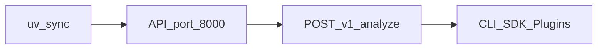

<script setup>
const steps = [
  { title: "Install deps", body: "Copy .env, uv sync, enable SQLite sync mode." },
  { title: "Run the API", body: "uvicorn on :8000 with your dev API key." },
  { title: "Analyze a URL", body: "curl /v1/analyze or mediacore analyze." },
]
const next = [
  { title: "Vision", href: "/getting-started/vision", hint: "Why MediaCore", icon: "https://cdn.simpleicons.org/rocket/FF4438" },
  { title: "Platforms", href: "/platforms/", hint: "Extractor catalog", icon: "https://cdn.simpleicons.org/youtube/FF0000" },
  { title: "Plugins", href: "/plugins/", hint: "Extend core", icon: "https://cdn.simpleicons.org/npm/CB3837" },
  { title: "Architecture", href: "/architecture/", hint: "How it fits", icon: "https://cdn.simpleicons.org/python/3776AB" },
  { title: "API", href: "/api/", hint: "REST /v1", icon: "https://cdn.simpleicons.org/fastapi/009688" },
  { title: "SDK", href: "/sdk/", hint: "Language clients", icon: "https://cdn.simpleicons.org/typescript/3178C6" },
  { title: "Deploy", href: "/deployment/", hint: "Docker & Helm", icon: "https://cdn.simpleicons.org/docker/2496ED" },
  { title: "Testing", href: "/getting-started/testing", hint: "TestKit & CI", icon: "https://cdn.simpleicons.org/pytest/0A9EDC" },
]
</script>

<DocHero
  eyebrow="Quick start"
  title="Getting started"
  lead="Run MediaCore locally in a few minutes — API, CLI, and your first analyze call."
/>

## Path

<DocSteps :items="steps" />



## Requirements

- Python 3.12+
- [uv](https://docs.astral.sh/uv/)
- Optional: Docker, FFmpeg, Redis

## Install & run

```bash
cp .env.example .env
uv sync --extra dev
export SYNC_DOWNLOAD=true USE_SQLITE=true
uv run uvicorn apps.api.main:app --reload --port 8000
```

Dev API key: `dev-api-key-change-me`

## First request

```bash
curl -s -H "X-API-Key: dev-api-key-change-me" \
  -H "Content-Type: application/json" \
  -d '{"url":"https://example.com/video.mp4"}' \
  http://localhost:8000/v1/analyze
```

## CLI

```bash
uv run mediacore doctor
uv run mediacore analyze https://example.com/video.mp4
uv run mediacore download https://example.com/video.mp4 --wait
uv run mediacore plugin list
uv run mediacore worker start
```

Global flags: `--base`, `--key` (env: `MEDIACORE_BASE`, `MEDIACORE_API_KEY`).

## Explore next

<DocLinks :items="next" />
