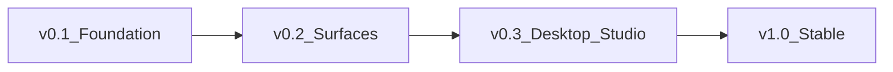

<DocHero
  eyebrow="Plan"
  title="Roadmap"
  lead="v0.1 Foundation → v0.2 Platform surfaces → v0.3 Desktop & Studio → v1.0 Stable ecosystem."
/>

<DocStats :items="phases" />

Statuses: **done** · **partial** · **planned**

## v0.1 — Foundation

| Item | Status | Notes |
|------|--------|-------|
| Engine | partial | Python `packages/engine`; Rust crate scaffold |
| Runtime | partial | Local workers; Docker/K8s expanding |
| CLI | done | `mediacore` |
| SDK | partial | Multi-language clients |
| Local storage | done | Default backend |
| TestKit | partial | Mocks, contracts, fixtures |

## v0.2 — Platform surfaces

| Item | Status | Notes |
|------|--------|-------|
| Dashboard | partial | Next.js + jobs/events |
| Event system | done | Bus, Redis, SSE, webhooks |
| Pipeline | partial | Analyze → download → process |
| Workers | done | Dramatiq |
| Plugin system | partial | Loader + storage/ffmpeg/webhook |
| REST API | done | `/v1/*` |
| Permitted providers | partial | Upgrade loop; Dropbox/Google Drive shared-file download; many `metadata_only` |
| CLI providers UX | done | `mediacore providers list\|search` + honest `not_configured` hints |

## v0.3 — Desktop, Studio & quality

| Item | Status | Notes |
|------|--------|-------|
| Desktop (Tauri) | planned | `apps/desktop` |
| Studio | planned | Visual workflows |
| Benchmark suite | partial | Python + Criterion |
| Marketplace | planned | Plugin discovery |

## v1.0 — Stable ecosystem

| Item | Status | Notes |
|------|--------|-------|
| Stable plugin API | planned | Versioned contracts |
| SDK compatibility | planned | Shared method names |
| Docs & deploy guides | planned | Site + runbooks |

## Principles

- Core first · Plugins for everything else · SDK consistency  
- DX is product · Open governance · Official/permitted access only  

## Related

<DocLinks :items="links" />
