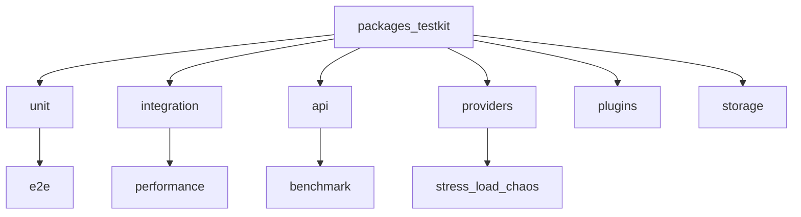

<script setup>
const links = [
  { title: "Benchmarks", href: "/benchmarks/", hint: "Latency & regressions", icon: "https://cdn.simpleicons.org/prometheus/E6522C" },
  { title: "Plugins", href: "/plugins/", hint: "Contract tests", icon: "https://cdn.simpleicons.org/npm/CB3837" },
  { title: "Platforms", href: "/platforms/", hint: "Provider contracts", icon: "https://cdn.simpleicons.org/youtube/FF0000" },
  { title: "Get started", href: "/getting-started/", hint: "Local setup", icon: "https://cdn.simpleicons.org/python/3776AB" },
]
const gates = [
  { value: "PR", label: "unit · api · contracts" },
  { value: "Nightly", label: "bench · stress · chaos" },
  { value: "≥40%", label: "Coverage floor" },
  { value: "TestKit", label: "Shared fakes" },
]
</script>

<DocHero
  eyebrow="Quality"
  title="Testing"
  lead="First-class TestKit, layered suites, and CI markers — so every provider and plugin can prove itself."
/>

<DocStats :items="gates" />

## Layout



## Run locally

```bash
uv sync --extra dev

# PR-critical suite
uv run pytest -m "not load and not stress and not chaos and not benchmark"

# Coverage
uv run pytest --cov=packages --cov=providers --cov=apps --cov-report=term-missing

# Benchmarks
uv run pytest -m benchmark --benchmark-only
uv run python -m packages.mediacore_benchmark.runner
```

## Markers

| Marker | PR CI | Nightly |
|--------|-------|---------|
| unit, integration, api, provider, plugin, storage | yes | yes |
| e2e, performance, security, regression | yes | yes |
| benchmark, stress, chaos | no | yes |
| load | no | optional |

## Contracts

Shared runners in `packages/testkit/contracts.py` for providers, plugins, and storage. Bug fixes add permanent tests under `tests/regression/`.

## Related

<DocLinks :items="links" />
