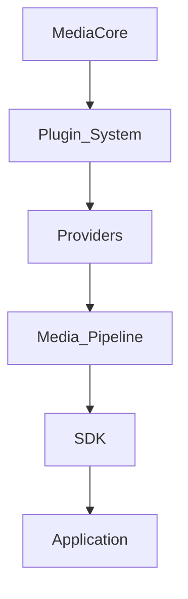

<script setup>
const links = [
  { title: "Architecture", href: "/architecture/", hint: "Layers & flow", icon: "https://cdn.simpleicons.org/python/3776AB" },
  { title: "Plugins", href: "/plugins/", hint: "Extend core", icon: "https://cdn.simpleicons.org/npm/CB3837" },
  { title: "Roadmap", href: "/getting-started/roadmap", hint: "v0.1 → v1.0", icon: "https://cdn.simpleicons.org/git/F05032" },
  { title: "Get started", href: "/getting-started/", hint: "Run locally", icon: "https://cdn.simpleicons.org/rocket/FF4438" },
]
</script>

<DocHero
  eyebrow="Product"
  title="Vision"
  lead="The Open Media Infrastructure Platform — Extract • Process • Automate • Deliver. Build media applications faster."
/>

MediaCore is positioned like FFmpeg for processing, Terraform for providers, or LangChain for workflows — a **unified developer platform**, not a single-purpose downloader.

Multi-site URL coverage is inspired by the breadth of community extractor catalogs, but MediaCore ships its **own** engine, registry, and providers. There is no scraper runtime dependency and no porting of third-party `_real_extract` logic — only host research for detection, then official or permitted APIs for metadata and download.

## Why it exists

Reusable building blocks instead of one-off media handlers:

- Media / podcast / video tools
- Clip, thumbnail, and converter apps
- AI subtitle generators
- Archive and automation pipelines
- CMS integrations and desktop clients

## Philosophy

Core never hardcodes YouTube, TikTok, or any single platform.



Everything is replaceable.

## Ecosystem

```text
Engine · Runtime · API · SDK · CLI · Dashboard · Desktop · Studio
Plugin Registry · Marketplace · Docs · Benchmark · TestKit
```

## Continue

<DocLinks :items="links" />
