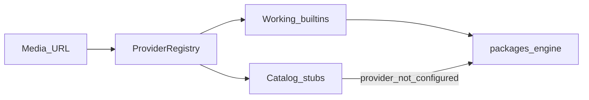

# Available platforms

MediaCore **never hardcodes scrape logic in core**. Platforms live under `providers/` and are resolved by the registry. The table below lists the **full catalog** (search + filter).



<PlatformCatalog />

## Catalog at runtime

| Endpoint | Purpose |
|----------|---------|
| `GET /v1/providers` | Working + stub providers (with capabilities) |
| `GET /v1/providers/catalog` | Catalog summary counts |
| `GET /v1/providers/catalog/search?q=` | Search extractors by name |

```bash
curl -s -H "X-API-Key: dev-api-key-change-me" \
  http://localhost:8000/v1/providers | head

curl -s -H "X-API-Key: dev-api-key-change-me" \
  "http://localhost:8000/v1/providers/catalog/search?q=youtube"
```

Regenerate stubs + docs list (`docs/public/platforms.json`):

```bash
uv run python scripts/sync_platform_catalog.py --offline
```

## Status meanings

| Status | Meaning |
|--------|---------|
| `available` / `active` | Safe to use in local/dev workflows |
| `metadata` / `metadata_only` | Metadata only (no download) |
| `stub` / `not_configured` | Catalog placeholder — wire official APIs |

## Next

- [Register an extractor](./register)
- [Providers vs plugins](/plugins/providers)
- [Compliance](/plugins/providers#compliance)
