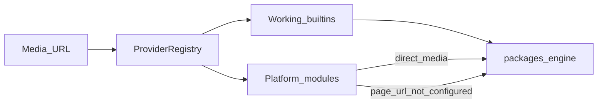

# Available platforms

MediaCore **never hardcodes scrape logic in core**. Platforms live under `providers/` and are resolved by the registry. The table below lists the **full catalog** (search + filter).

**Permitted access:** “Supports platform X” means host detection plus metadata/download when a public or official API (or direct media) allows it — not watch-URL scraping for every site. Catalog modules stay for routing; page URLs without a permitted path return `provider_not_configured`. Contributor layout: repository file `providers/README.md`.

Rough scale: ~20+ working builtins (`active` / `metadata_only`) and ~1300 catalog modules for host detection. CLI: `mediacore providers list` / `mediacore providers search QUERY`.



<PlatformCatalog />

## Catalog at runtime

| Endpoint | Purpose |
|----------|---------|
| `GET /v1/providers` | Working + platform modules (with capabilities) |
| `GET /v1/providers/catalog` | Catalog summary counts |
| `GET /v1/providers/catalog/search?q=` | Search extractors by name |

```bash
curl -s -H "X-API-Key: dev-api-key-change-me" \
  http://localhost:8000/v1/providers | head

curl -s -H "X-API-Key: dev-api-key-change-me" \
  "http://localhost:8000/v1/providers/catalog/search?q=youtube"
```

Regenerate modules (`providers/modules/<slug>/`) and docs list:

```bash
uv run python scripts/sync_platform_catalog.py --offline
# also writes providers/modules/_manifest.json (~1360 module folders)
```

## Working builtins (metadata / download)

| Provider | Status | Access |
|----------|--------|--------|
| `filesystem` | `active` | Local `file://` paths |
| `generic` | `active` | Direct HTTP(S) media URLs |
| `example` | `example` | Demo `mediacore://` URLs |
| `youtube` | `metadata_only` | Public oEmbed |
| `tiktok` | `metadata_only` | Public oEmbed |
| `vimeo` | `metadata_only` | Public oEmbed |
| `dailymotion` | `metadata_only` | Public oEmbed |
| `soundcloud` | `metadata_only` | Public oEmbed |
| `reddit` | `metadata_only` | Public oEmbed |
| `ted` | `metadata_only` | Public oEmbed |
| `wikimedia.org` | `metadata_only` | MediaWiki REST summary API |
| `bandcamp` | `metadata_only` | Public oEmbed |
| `mixcloud` | `metadata_only` | Public oEmbed |
| `streamable` | `metadata_only` | Public oEmbed |
| `imgur` | `metadata_only` | Public oEmbed |
| `archiveorg` | `metadata_only` | Public oEmbed |
| `flickr` | `metadata_only` | Public oEmbed |
| `applepodcasts` | `metadata_only` | Public iTunes Lookup API |
| `abc.net.au` | `metadata_only` | Public iView catalog API (show pages) |
| `bbc` | `metadata_only` | Public `/programmes/{pid}.json` |
| `bilibili` | `metadata_only` | Public web view API (BV/av) |
| `bitchute` | `metadata_only` | Public beta video API |
| `dropbox` | `active` | Shared file links via official `dl=1` |
| `google_drive` | `active` | Public file shares via `uc?export=download` |
| `media.ccc.de` | `active` | Public JSON API + recording download URLs |

Catalog modules with the same `name` are skipped when these working providers register first.

## Status meanings

| Status | Meaning |
|--------|---------|
| `available` / `active` | Safe to use in local/dev workflows |
| `metadata` / `metadata_only` | Metadata only (no download of page URLs) |
| `not_configured` | Catalog module — direct media OK; page URLs need official APIs |

## Next

- [Register an extractor](./register)
- [Providers vs plugins](/plugins/providers)
- [Compliance](/plugins/providers#compliance)
