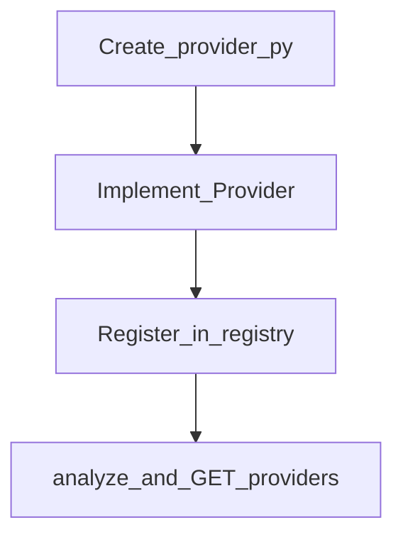

# Register an extractor

An **extractor** (provider) teaches MediaCore how to analyze / download a URL class.

## Contract

Implement `packages.core.provider.Provider`:

| Stage | Method | Returns |
|-------|--------|---------|
| Detect | `supports(url)` | `bool` |
| Metadata | `metadata(url)` / `get_metadata` | `MediaMetadata` |
| Formats | `formats(url)` / `list_formats` | `list[FormatInfo]` |
| Download | `download(url, format_id, dest)` | `DownloadResult` |
| Thumbnail | `thumbnail(url)` | optional |
| Subtitles | `subtitles(url)` | optional |



## Steps

<div class="mc-steps">
  <div class="mc-step"><div class="n">1</div><div>
    <strong>Create the package</strong>
    <pre>providers/myplatform/provider.py</pre>
  </div></div>
  <div class="mc-step"><div class="n">2</div><div>
    <strong>Implement the Provider class</strong>
    <p>Set <code>name</code>, <code>status</code>, and the required methods.</p>
  </div></div>
  <div class="mc-step"><div class="n">3</div><div>
    <strong>Register early in the registry</strong>
    <p>Add the module path to <code>build_default_registry()</code> in <code>packages/registry/providers.py</code> <em>before</em> generic/fallback providers.</p>
  </div></div>
  <div class="mc-step"><div class="n">4</div><div>
    <strong>Verify</strong>
    <pre>uv run mediacore analyze https://myplatform.example/video
curl -H "X-API-Key: …" http://localhost:8000/v1/providers</pre>
  </div></div>
</div>

## Minimal example

```python
# providers/myplatform/provider.py
from pathlib import Path
from packages.core.models import DownloadResult, FormatInfo, MediaMetadata
from packages.core.provider import Provider

class MyPlatformProvider(Provider):
    name = "myplatform"
    status = "active"

    def supports(self, url: str) -> bool:
        return "myplatform.example" in url

    def get_metadata(self, url: str) -> MediaMetadata:
        return MediaMetadata(
            platform=self.name,
            url=url,
            title="Demo",
            formats=[FormatInfo(id="original", quality="original", container="mp4")],
            manifest={"type": "myplatform"},
        )

    def list_formats(self, url: str) -> list[FormatInfo]:
        return self.get_metadata(url).formats

    def download(self, url: str, format_id: str, dest: Path) -> DownloadResult:
        # fetch with permission / official API, write to dest
        ...
```

Register:

```python
# packages/registry/providers.py — inside build_default_registry()
for module_name in (
    "providers.filesystem.provider",
    "providers.myplatform.provider",  # ← add here
    "providers.vimeo.provider",
):
    _register_module(registry, module_name)
```

## Catalog stubs

For platforms that are not ready, regenerate stubs instead of hand-writing thousands of files:

```bash
uv run python scripts/sync_platform_catalog.py --offline
```

Stubs appear in `GET /v1/providers` with `not_configured` until you replace them with a real provider (same `name` wins if registered earlier).

## Tests

```bash
uv run pytest -m provider
# Contract helper
# packages.testkit.contracts.run_provider_contract(...)
```

## Compliance

Use **official / supported APIs** or content you have permission to access. MediaCore does not bypass platform access controls.
