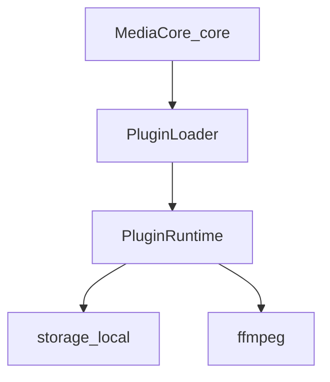

# Plugin catalog

Download-tool plugins are minimal. Capabilities beyond the core pipeline live under `plugins/`.

| Plugin | Role |
|--------|------|
| `mediacore-plugin-ffmpeg` | Convert / remux after a permitted download |
| `mediacore-plugin-storage-local` | Local artifact storage |



## Runtime

```bash
uv run mediacore plugin list
curl -s -H "X-API-Key: dev-api-key-change-me" http://localhost:8000/v1/plugins
```

- `get_storage()` — default **local**
- `ensure_ffmpeg()` / `ffmpeg()` — FFmpeg plugin + binary

## Guides

| Guide | Description |
|-------|-------------|
| [Register a plugin](./register) | Manifest, kinds, `create` |
| [Storage](./storage) | Local storage |
| [Providers vs plugins](./providers) | Site logic lives in `providers/` |
