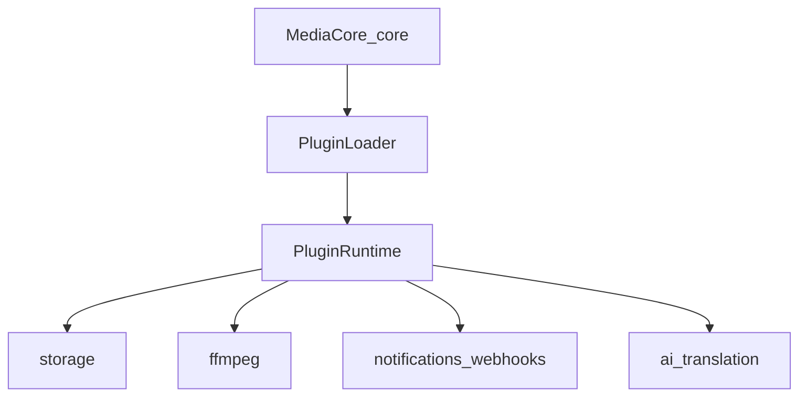

# Plugin catalog

MediaCore stays small. Capabilities beyond the core pipeline come from plugins under `plugins/`. The grid below lists **all** discovered plugins (search + filter by kind/status).



<PluginCatalog />

## Quick links

| Guide | Description |
|-------|-------------|
| [Register a plugin](./register) | Manifest, kinds, `create` / `on_event` |
| [Storage](./storage) | Local + optional cloud backends |
| [Providers vs plugins](./providers) | Extractors live in `providers/` |

## Runtime

```bash
uv run mediacore plugin list
curl -s -H "X-API-Key: dev-api-key-change-me" http://localhost:8000/v1/plugins
```

`packages.plugins.runtime`:

- `get_storage()` — default **local**; cloud only when `STORAGE_BACKEND` is set
- `ensure_ffmpeg()` / `ffmpeg()` — FFmpeg plugin + binary / service
- `metadata_normalizer()` — enrich analyze results
- `dispatch_event(event)` — webhook / telegram / discord / analytics `on_event` (single path)
- `create(name)` — call a plugin factory

Refresh the docs UI data after adding plugins:

```bash
uv run python scripts/generate_plugins_docs.py
```

## Naming

```text
mediacore-plugin-<area>[-<impl>]
```

Local install: `mediacore plugin install NAME|PATH` (copy + validate). Marketplace install remains on the roadmap.
