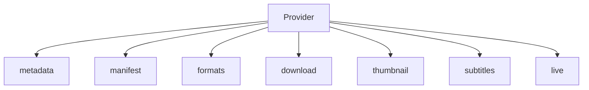
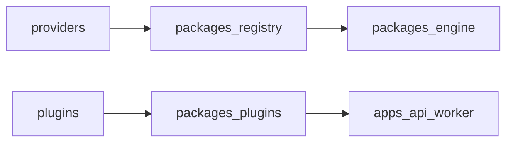

# Providers vs plugins

MediaCore core never hardcodes scrape logic. **Extractors** live under `providers/` and are registered via `packages/registry`. **Plugins** live under `plugins/` and add optional capabilities (storage, FFmpeg, webhooks).

See also: [Available platforms](/platforms/) · [Register an extractor](/platforms/register) · [Register a plugin](/plugins/register).

## Architecture





Implement `packages.core.provider.Provider` and declare `capabilities` via `ProviderCapabilities`.

| Stage | Method | Returns |
|-------|--------|---------|
| Metadata | `metadata(url)` | `MediaMetadata` |
| Manifest | `manifest(url)` | `Manifest` |
| Formats | `formats(url)` | `list[FormatInfo]` |
| Download | `download(url, format_id, dest)` | `DownloadResult` |
| Thumbnail | `thumbnail(url)` | `ThumbnailInfo \| None` |
| Subtitle | `subtitles(url)` | `list[SubtitleTrack]` |
| Live | `live(url)` | `LiveInfo \| None` |

Back-compat aliases: `get_metadata` → `metadata`, `list_formats` → `formats`.

## Built-in (working)

| Provider | Role |
|----------|------|
| `filesystem` | `file://` and local paths |
| `generic` | Direct media HTTP(S) URLs |
| `vimeo` | Public oEmbed metadata |
| `dailymotion` | Public oEmbed metadata |
| `soundcloud` | Public oEmbed metadata |
| `reddit` | Public oEmbed metadata |
| `ted` | Public oEmbed metadata |
| `wikimedia.org` | MediaWiki REST summary metadata |
| `example` | `mediacore://example/...` demo |

## Full platform catalog

All known extractors are implemented as MediaCore stub providers:

```bash
# Regenerate from existing snapshot
uv run python scripts/sync_platform_catalog.py --offline

# Refresh from a local sites markdown file
uv run python scripts/sync_platform_catalog.py --file ./sites.md
```

| File | Purpose |
|------|---------|
| `providers/data/sites_snapshot.json` | Catalog snapshot (input) |
| `providers/data/extractors.json` | Clean extractor list |
| `providers/data/providers_index.json` | All stub providers (+ hosts where known) |

- **~1370+ stub providers** registered at runtime
- **~120+** have host maps for URL detection
- Status is `not_configured` (or `broken`) until you wire permitted/official access

### API

```http
GET /v1/providers
GET /v1/providers/catalog
GET /v1/providers/catalog/search?q=youtube
POST /v1/analyze
POST /v1/live
```

`GET /v1/providers` includes each provider's `capabilities` list.

## Compliance

Use **official/supported APIs** or content you have permission to access.
Stub providers raise `provider_not_configured` until enabled.

## Adding a working provider

1. Create `providers/<name>/provider.py`
2. Implement the seven stages (or rely on defaults where capabilities are false)
3. Set `capabilities = ProviderCapabilities(...)`
4. Register early in `packages/registry/providers.py`
