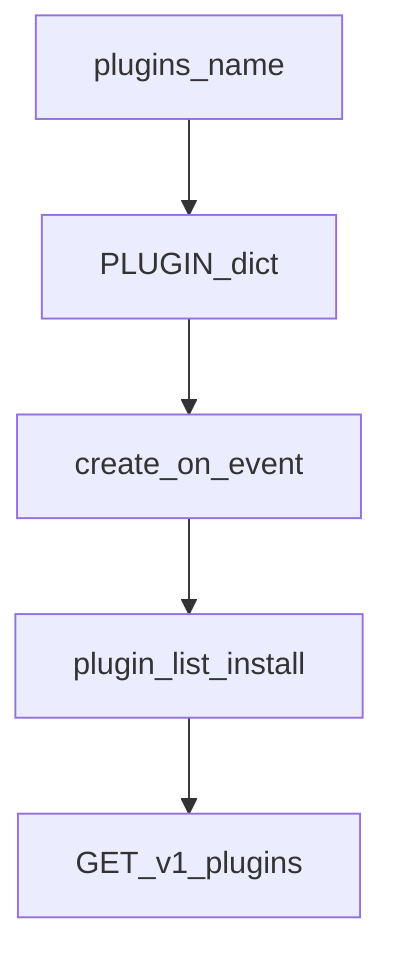

# Register a plugin

Plugins add optional capabilities (storage, FFmpeg, webhooks, AI, …) without growing the core.

## Naming

```text
mediacore-plugin-<area>[-<impl>]
plugins/<area>[-<impl>]/plugin.py
```

Examples: `storage-local`, `storage-s3`, `ffmpeg`, `webhook`.



## Steps

<div class="mc-steps">
  <div class="mc-step"><div class="n">1</div><div>
    <strong>Create the plugin directory</strong>
    <pre>plugins/my-capability/plugin.py</pre>
  </div></div>
  <div class="mc-step"><div class="n">2</div><div>
    <strong>Declare the PLUGIN manifest</strong>
    <p>Required: <code>name</code>, <code>kind</code>, <code>status</code>, <code>capabilities</code>.</p>
  </div></div>
  <div class="mc-step"><div class="n">3</div><div>
    <strong>Export runtime hooks</strong>
    <p><code>create(settings)</code> for factories (storage), and/or <code>on_event(event)</code> for notifications.</p>
  </div></div>
  <div class="mc-step"><div class="n">4</div><div>
    <strong>Discover & install</strong>
    <pre>uv run mediacore plugin list
uv run mediacore plugin install ./plugins/my-capability
curl -H "X-API-Key: …" http://localhost:8000/v1/plugins</pre>
  </div></div>
</div>

## Manifest template

```python
# plugins/my-capability/plugin.py
PLUGIN = {
    "name": "mediacore-plugin-my-capability",
    "version": "0.1.0",
    "kind": "storage",  # see kinds below
    "description": "What this plugin does",
    "status": "available",  # available | stub | disabled | error
    "capabilities": ["store", "delete", "public_url"],
}

def create(settings, *, root=None):
    """Optional factory used by PluginRuntime / storage resolver."""
    ...

def on_event(event):
    """Optional — notifications / webhooks."""
    ...
```

## Kinds

| Kind | Purpose |
|------|---------|
| `storage` | Persist job outputs |
| `ffmpeg` | Convert / audio / thumbnail / clip |
| `webhooks` | HTTP event forwarding |
| `notifications` | Telegram, Discord, … |
| `ai` | Whisper / STT |
| `translation` | Subtitle translation |
| `metadata` | Enrich metadata |
| `authentication` | Auth adapters |
| `analytics` | Metrics sinks |
| `provider` | Optional bridge to extractors |

## Storage plugins

When `kind == "storage"`:

1. Implement `packages.storage.base.StorageBackend` (or reuse local staging).
2. Export `create(settings, *, root=None)`.
3. Map the backend name in `packages/storage/factory.py` → `BACKEND_PLUGINS`.
4. Select with `STORAGE_BACKEND=…` (default remains **`local`** — cloud is optional).

See [Storage](./storage).

## Discovery

`PluginLoader` scans `plugins/*/plugin.py` at runtime. No core import of your plugin is required for listing; factories are loaded when the capability is requested.

```bash
uv run mediacore plugin list
uv run pytest -m plugin
```

## Tips

- Keep `status: "stub"` until credentials + client work end-to-end.
- Local-only workflows must keep working with `STORAGE_BACKEND=local` and no cloud SDKs installed.
- Prefer small plugins over growing `packages/core`.
