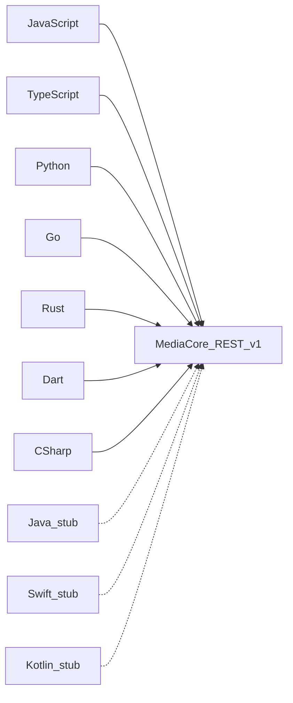

# MediaCore SDKs

Official clients share one surface against the REST API (`X-API-Key`). Browse support below, then open a language page for install and examples.

<SdkCatalog />



## Unified API

```text
client.media.analyze(url)
client.media.download(url, format?)
client.media.convert(path|url, options?)
client.media.thumbnail(url)

client.jobs.list()
client.jobs.get(id)

client.plugins.list()
```

Language-idiomatic naming is fine (`AnalyzeAsync` in C#, `Media.Analyze` in Go) as long as namespaces stay `media` / `jobs` / `plugins`.

## REST mapping

| SDK method | HTTP |
|------------|------|
| `media.analyze` | `POST /v1/analyze` |
| `media.download` | `POST /v1/download` |
| `media.convert` | `POST /v1/convert` |
| `media.thumbnail` | `POST /v1/thumbnail` |
| `jobs.list` | `GET /v1/jobs` |
| `jobs.get` | `GET /v1/jobs/{id}` |
| `plugins.list` | `GET /v1/plugins` |

Full HTTP reference: [API](/api/).

## Language guides

| SDK | Status | Detail |
|-----|--------|--------|
| [JavaScript](./javascript) | Ready | `@mediacore/sdk` |
| [TypeScript](./typescript) | Ready | `@mediacore/sdk-ts` |
| [Python](./python) | Ready | `mediacore_sdk` |
| [Go](./go) | Ready | `mediacore` |
| [Rust](./rust) | Ready | `mediacore_sdk` |
| [Dart](./dart) | Ready | `mediacore` |
| [C#](./csharp) | Ready | `MediaCore` |
| [Java](./java) | Stub | `io.mediacore` |
| [Swift](./swift) | Stub | `MediaCore` |
| [Kotlin](./kotlin) | Stub | `io.mediacore` |
